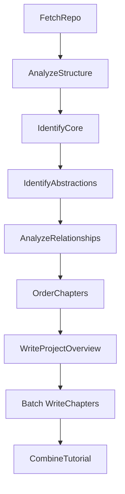

# System Design: AI Agent Development Documentation Builder

> Please DON'T remove notes for AI

## Requirements

> Notes for AI: Keep it simple and clear.
> If the requirements are abstract, write concrete user stories

**User Story:** As a developer using AI agents in my development workflow, I want comprehensive technical documentation automatically generated from any codebase (GitHub repository or local directory), so that my AI agents can understand the project architecture, core abstractions, implementation details, and development patterns through semantic search during feature implementation.

**Input:**
- A publicly accessible GitHub repository URL or a local directory path.
- A project name (optional, will be derived from the URL/directory if not provided).
- Desired language for the documentation (optional, defaults to English).

**Output:**
- A directory named after the project containing:
    - A `project_overview.md` file with:
        - Complete project summary and purpose
        - Architecture overview and design patterns
        - Technology stack and dependencies
        - Development guidelines and conventions
        - Navigation guide for AI agents
    - An `index.md` file with:
        - Technical project summary
        - Mermaid architecture diagrams showing component relationships
        - Ordered list of links to detailed component documentation
    - Individual Markdown files for each core component (`01_component_name.md`, `02_another_component.md`, etc.) containing:
        - Detailed technical specifications
        - Implementation patterns and approaches
        - Code examples and usage patterns
        - Inter-component relationships and dependencies
        - API interfaces and data structures

## Flow Design

> Notes for AI:
> 1. Consider the design patterns of agent, map-reduce, rag, and workflow. Apply them if they fit.
> 2. Present a concise, high-level description of the workflow.

### Applicable Design Pattern:

This project uses a **Multi-Pass Hierarchical Workflow** pattern to generate comprehensive AI agent documentation. The approach analyzes codebases at multiple levels of detail to create both high-level architectural understanding and deep technical implementation details:

1.  **Workflow:** Sequential analysis phases with increasing technical depth.
2.  **Hierarchical Analysis:** Structure → Core Components → Detailed Technical Analysis → AI-Optimized Documentation.
3.  **Batch Processing:** Individual component documentation generation with cross-referencing.

### Flow high-level Design:

1.  **`FetchRepo`**: Crawls the specified GitHub repository URL or local directory, retrieving source code files and extracting comprehensive metadata.
2.  **`AnalyzeStructure`**: Performs structural analysis using file paths, imports/dependencies, and architectural patterns to understand codebase organization.
3.  **`IdentifyCore`**: Uses structural analysis to identify the most important files/modules representing core abstractions and architectural components.
4.  **`IdentifyAbstractions`**: Analyzes core files to identify key abstractions, their responsibilities, and implementation patterns.
5.  **`AnalyzeRelationships`**: Deep analysis of component interactions, data flow, and architectural relationships.
6.  **`OrderChapters`**: Determines logical presentation order based on dependency hierarchy and architectural layers.
7.  **`WriteProjectOverview`**: **NEW** - Generates comprehensive project overview for AI agent system prompts.
8.  **`WriteChapters` (BatchNode)**: Generates detailed technical documentation for each component with comprehensive implementation details.
9.  **`CombineTutorial`**: **MODIFIED** - Assembles final documentation structure with enhanced cross-referencing and navigation.



## Utility Functions

> Notes for AI:
> 1. Understand the utility function definition thoroughly by reviewing the doc.
> 2. Include only the necessary utility functions, based on nodes in the flow.

1.  **`crawl_github_files`** (`utils/crawl_github_files.py`) - *External Dependency: requests, gitpython (optional for SSH)*
    *   *Input*: `repo_url` (str), `token` (str, optional), `max_file_size` (int, optional), `use_relative_paths` (bool, optional), `include_patterns` (set, optional), `exclude_patterns` (set, optional)
    *   *Output*: `dict` containing `files` (dict[str, str]) and `stats`.
    *   *Necessity*: Required by `FetchRepo` to download and read source code from GitHub if a `repo_url` is provided.
2.  **`crawl_local_files`** (`utils/crawl_local_files.py`) - *External Dependency: None*
    *   *Input*: `directory` (str), `max_file_size` (int, optional), `use_relative_paths` (bool, optional), `include_patterns` (set, optional), `exclude_patterns` (set, optional)
    *   *Output*: `dict` containing `files` (dict[str, str]).
    *   *Necessity*: Required by `FetchRepo` to read source code from a local directory if a `local_dir` path is provided.
3.  **`analyze_file_structure`** (`utils/analyze_file_structure.py`) - *External Dependency: ast, tree-sitter (optional)*
    *   *Input*: `files` (dict[str, str]), `language_patterns` (dict, optional)
    *   *Output*: `dict` containing structural information (imports, exports, dependencies, entry points, etc.)
    *   *Necessity*: Required by `AnalyzeStructure` to extract structural information without full content analysis.
4.  **`call_llm`** (`utils/call_llm.py`) - *External Dependency: LLM Provider API (e.g., Google GenAI)*
    *   *Input*: `prompt` (str), `use_cache` (bool, optional)
    *   *Output*: `response` (str)
    *   *Necessity*: Used by multiple nodes for code analysis and content generation.

## Node Design

### Shared Store

> Notes for AI: Try to minimize data redundancy

The shared Store structure is organized as follows:

```python
shared = {
    # --- Inputs ---
    "repo_url": None, # Provided by the user/main script if using GitHub
    "local_dir": None, # Provided by the user/main script if using local directory
    "project_name": None, # Optional, derived from repo_url/local_dir if not provided
    "github_token": None, # Optional, from argument or environment variable
    "output_dir": "output", # Default or user-specified base directory for output
    "include_patterns": set(), # File patterns to include
    "exclude_patterns": set(), # File patterns to exclude
    "max_file_size": 100000, # Default or user-specified max file size
    "language": "english", # Default or user-specified language for the documentation

    # --- Intermediate/Output Data ---
    "files": [], # Output of FetchRepo: List of tuples (file_path: str, file_content: str)
    "structure": {}, # Output of AnalyzeStructure: Comprehensive structural analysis
    "core_files": [], # Output of IdentifyCore: List of indices of most important files
    "abstractions": [], # Output of IdentifyAbstractions: List of {"name": str, "description": str, "files": [int], "technical_details": dict}
    "relationships": { # Output of AnalyzeRelationships
         "summary": None, # Technical project summary
         "architecture_overview": None, # Architectural patterns and design decisions
         "details": [], # Detailed component relationships with technical context
         "data_flow": [], # Data flow patterns and transformations
         "api_interfaces": [] # Interface definitions and contracts
     },
    "chapter_order": [], # Output of OrderChapters: Logical order based on architectural hierarchy
    "project_overview": None, # Output of WriteProjectOverview: Comprehensive project overview for AI agents
    "chapters": [], # Output of WriteChapters: Detailed technical documentation for each component
    "final_output_dir": None # Output of CombineTutorial: Path to the final generated documentation
}
```

### Node Steps

> Notes for AI: Carefully decide whether to use Batch/Async Node/Flow.

1.  **`FetchRepo`**
    *   *Purpose*: Download repository code and extract comprehensive metadata for deep analysis.
    *   *Type*: Regular
    *   *Steps*: Same as before, but with enhanced metadata extraction.

2.  **`AnalyzeStructure`**
    *   *Purpose*: Comprehensive structural analysis including architectural patterns, design decisions, and technical dependencies.
    *   *Type*: Regular
    *   *Steps*:
        *   `prep`: Prepare enhanced analysis context with architectural pattern detection.
        *   `exec`: Deep structural analysis including dependency graphs, architectural layers, and design patterns.
        *   `post`: Write comprehensive structural analysis to shared store.

3.  **`IdentifyCore`**
    *   *Purpose*: Identify core architectural components and their technical significance.
    *   *Type*: Regular
    *   *Steps*: Enhanced to consider architectural importance and technical complexity.

4.  **`IdentifyAbstractions`** - **ENHANCED**
    *   *Purpose*: Deep analysis of core components including implementation patterns, responsibilities, and technical specifications.
    *   *Type*: Regular
    *   *Steps*:
        *   `prep`: Prepare comprehensive technical context for each core component.
        *   `exec`: Generate detailed technical abstractions with implementation patterns, responsibilities, and architectural role.
        *   `post`: Write enhanced abstractions with technical details to shared store.

5.  **`AnalyzeRelationships`** - **ENHANCED**
    *   *Purpose*: Comprehensive analysis of component interactions, data flow, architectural patterns, and API interfaces.
    *   *Type*: Regular
    *   *Steps*:
        *   `prep`: Prepare context including all technical abstractions and structural analysis.
        *   `exec`: Generate detailed relationship analysis including data flow, API contracts, and architectural decisions.
        *   `post`: Write comprehensive relationship analysis to shared store.

6.  **`OrderChapters`**
    *   *Purpose*: Order components based on architectural hierarchy and dependency layers.
    *   *Type*: Regular
    *   *Steps*: Enhanced to consider architectural layering and logical development flow.

7.  **`WriteProjectOverview`** - **NEW NODE**
    *   *Purpose*: Generate comprehensive project overview specifically designed for AI agent system prompts.
    *   *Type*: Regular
    *   *Steps*:
        *   `prep`: Collect all project analysis data including structure, abstractions, and relationships.
        *   `exec`: Generate comprehensive project overview covering architecture, patterns, guidelines, and navigation instructions for AI agents.
        *   `post`: Write project overview content to shared store.

8.  **`WriteChapters`** - **ENHANCED**
    *   *Purpose*: Generate detailed technical documentation for each component with comprehensive implementation details.
    *   *Type*: **BatchNode**
    *   *Steps*:
        *   `prep`: Prepare comprehensive technical context for each component.
        *   `exec(item)`: Generate in-depth technical documentation including implementation details, usage patterns, API interfaces, and cross-component relationships.
        *   `post`: Combine all detailed technical documentation.

9.  **`CombineTutorial`** - **ENHANCED**
    *   *Purpose*: Assemble final documentation structure with project overview, enhanced cross-referencing, and AI agent navigation features.
    *   *Type*: Regular
    *   *Steps*:
        *   `prep`: Collect project overview and all chapter documentation.
        *   `exec`: Generate enhanced index with technical architecture diagrams and navigation aids.
        *   `post`: Create final documentation structure including project overview file.